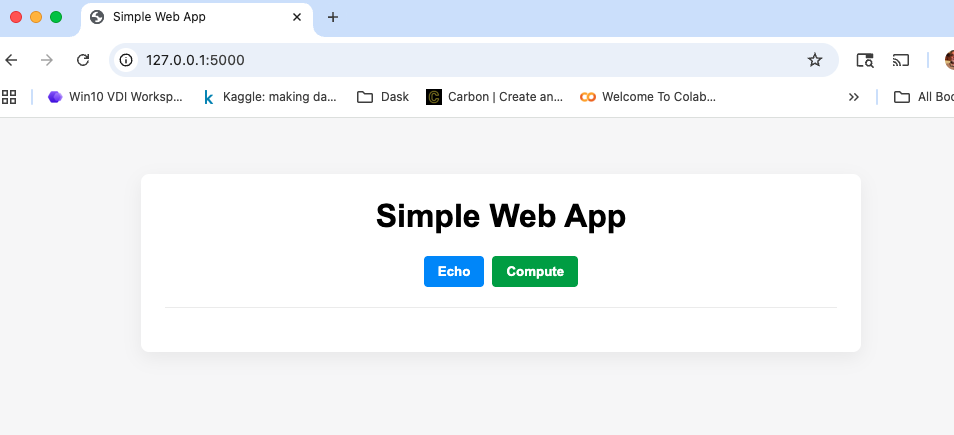
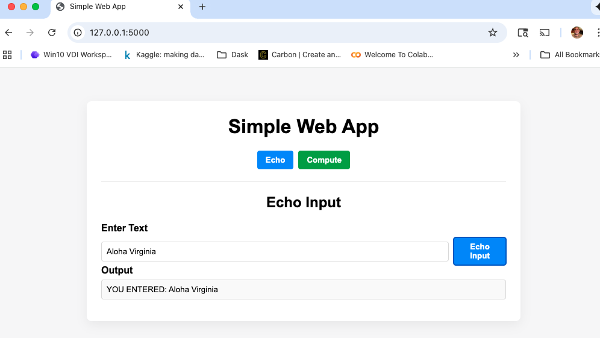
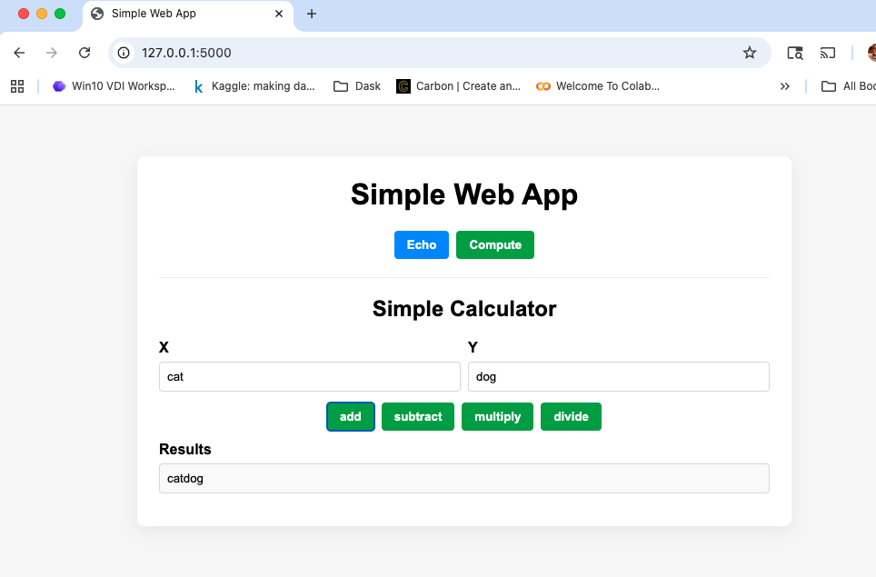
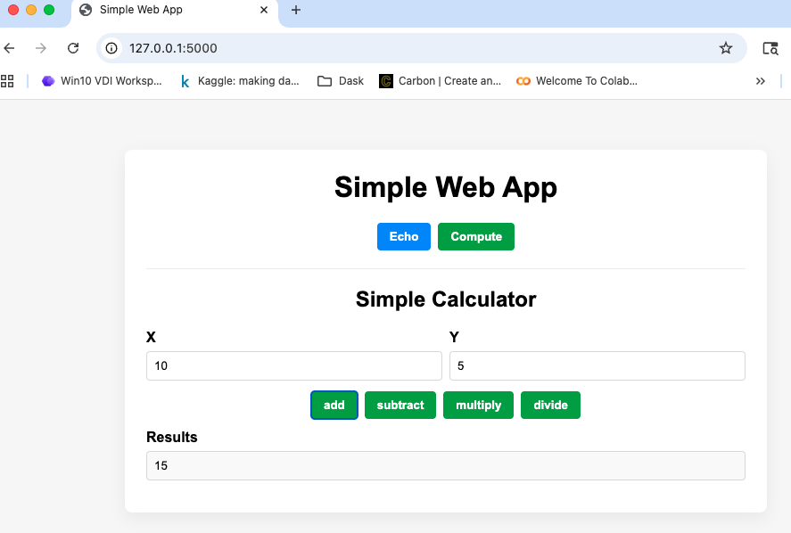
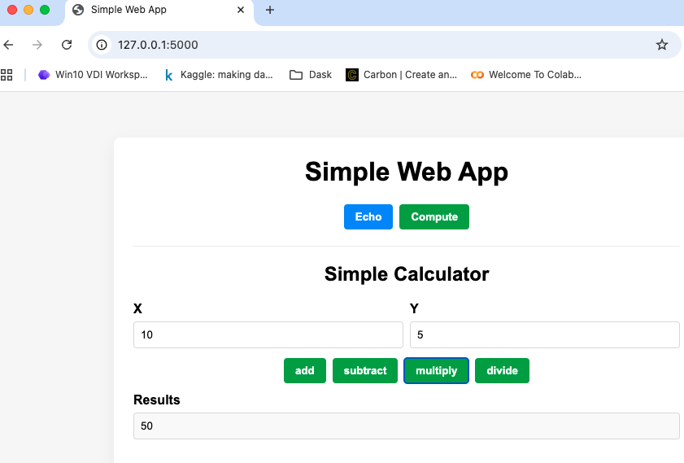
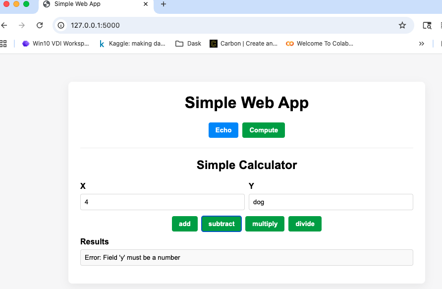

# Simple Web Application (Spec Kit)

This repository is a dynamic web application created as a specification kit demonstrating a complete TDD (Test-Driven Development) workflow. It features a Flask backend with REST API endpoints, a JavaScript frontend with dynamic interface switching, comprehensive test suite, and complete specification documents.

## Features

- **Dynamic Web Interface**: Single-page application with mode switching between Echo and Calculator functions
- **Echo Service**: Text input with "YOU ENTERED: " prefix response and empty input validation
- **Calculator Service**: Mathematical operations (add, subtract, multiply, divide) with intelligent type handling
- **Smart Add Function**: Automatic detection between numeric addition and string concatenation
- **REST API**: Three JSON-based API endpoints with consistent response format (`{success, result, error}`)
- **Error Handling**: Comprehensive validation and user-friendly error messages
- **TDD Approach**: Complete test coverage with contract, integration, and unit tests

**Repository layout**
- `src/`: application code
  - `app.py` - main Flask application entry (serves dynamic web UI and API endpoints)
  - `models.py` - domain/data logic and request/response model functions
  - `services.py` - service layer implementing business logic for echo, add, and calculate operations
  - `static/` - frontend assets (`index.html`, `app.js`, `styles.css`)
- `specs/`: human-readable specifications and supporting documents
  - `001-simple-web-application/`: Initial web application specification
  - `003-dynamic-web-page/`: Dynamic web page feature specification with UI mode switching
  - Each spec includes: `spec.md`, `plan.md`, `quickstart.md`, `data-model.md`, `research.md`, `tasks.md`
  - `contracts/openapi.yaml` - OpenAPI contracts for API endpoints
- `tests/`: automated tests
  - `unit/` - unit tests for models and services
  - `integration/` - integration tests exercising quickstart scenarios and user flows
  - `contract/` - contract tests verifying API contract expectations
- `requirements.txt`, `pyproject.toml`, `pytest.ini` - project configuration and dependencies

Quick overview
- The application code lives in `src/` and implements the dynamic web interface described in `specs/003-dynamic-web-page/`.
- Dynamic UI in `src/static/` provides mode switching between Echo and Calculator functions.
- Three API endpoints support the frontend functionality with intelligent type handling and validation.
- Tests are organized into unit, integration, and contract tests to validate behavior and the OpenAPI contract.

Getting started

Prerequisites
- Python 3.11+ (project was exercised with CPython 3.12 artifacts present; 3.11+ recommended)
- Install dependencies (prefer a virtual environment):

```bash
python -m venv .venv
source .venv/bin/activate
pip install -r requirements.txt
```

## Run the Application

### Development Server

```bash
# from repository root
source venv/bin/activate
PYTHONPATH=src python -m flask --app src.app run --debug --port 5000
```

### Alternative (Direct Script)

```bash
# from repository root  
source venv/bin/activate
cd src && python app.py
```

Open a browser at `http://127.0.0.1:5000` to access the web application.

### Web Interface

The application provides a dynamic single-page interface with:

- **Mode Switching**: Toggle between Echo and Calculator functions using top navigation buttons
- **Echo Mode**: Text input field with echo functionality and empty input validation
- **Calculator Mode**: Two input fields (X, Y) with four operation buttons (add, subtract, multiply, divide)
- **Smart Input Handling**: Automatic type detection for numeric vs. string operations
- **Error Handling**: User-friendly error messages for invalid inputs and edge cases

### API Endpoints

The application provides three REST API endpoints:

- `POST /api/echo` - Echo text input with "YOU ENTERED: " prefix
- `POST /api/add` - Intelligent add operation (numeric addition or string concatenation)
- `POST /api/calculate` - Mathematical operations (add, subtract, multiply, divide)

Example API usage:

```bash
# Echo service
curl http://127.0.0.1:5000/api/echo -X POST -H "Content-Type: application/json" -d '{"text":"Hello World"}'
# Response: {"success": true, "result": "YOU ENTERED: Hello World"}

# Add service (string concatenation)
curl http://127.0.0.1:5000/api/add -X POST -H "Content-Type: application/json" -d '{"x":"foo","y":"bar"}'
# Response: {"success": true, "result": "foobar"}

# Add service (numeric addition)
curl http://127.0.0.1:5000/api/add -X POST -H "Content-Type: application/json" -d '{"x":"10","y":"5"}'
# Response: {"success": true, "result": 15}

# Calculate service  
curl http://127.0.0.1:5000/api/calculate -X POST -H "Content-Type: application/json" -d '{"x":10,"y":5,"operation":"multiply"}'
# Response: {"success": true, "result": 50}

# Error handling example
curl http://127.0.0.1:5000/api/echo -X POST -H "Content-Type: application/json" -d '{"text":""}'
# Response: {"success": false, "error": "Text input cannot be empty"}
```

### Example Web Pages

### Home Page



### Echo Function Example


### Add Two Strings


### Add Two Numbers


### Multiply Two Numbers


### Subtract Invalid Input


Testing

Run the full test suite with pytest:

```bash
pytest -q
```

Run specific test groups:

```bash
pytest tests/unit -q
pytest tests/integration -q
pytest tests/contract -q
```

## Architecture Notes

- **Dynamic UI**: Frontend implements mode switching with interface clearing between transitions
- **Smart Type Handling**: Add operation automatically detects and handles mixed data types
- **Consistent Error Format**: All API endpoints return standardized `{success, result, error}` responses
- **Comprehensive Validation**: Input validation with user-friendly error messages

## Project Notes

- The `specs/003-dynamic-web-page` folder contains the current feature specification with detailed user scenarios and acceptance criteria
- The `specs/001-simple-web-application` folder contains the foundational API specification and OpenAPI contract (`contracts/openapi.yaml`)
- `tests/contract` contains contract tests that validate the service against the OpenAPI contract — run these after starting the app or as part of your CI pipeline
- Integration tests cover the complete user workflows including mode switching and error handling scenarios

## Contributing and Next Steps

- Add CI to run `pytest` on each PR and to publish test coverage
- Add linting (`flake8`/`ruff`) and type checking (`mypy`) to enforce quality
- Consider mobile responsiveness (current design is desktop-focused per spec)
- Add authentication and session management for multi-user scenarios

## References

- See `specs/003-dynamic-web-page/spec.md` for current feature requirements and user scenarios
- See `specs/003-dynamic-web-page/quickstart.md` for user validation scenarios and testing workflows
- See `specs/001-simple-web-application/` for foundational API design decisions and setup notes
